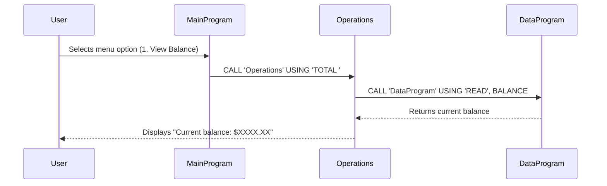

# COBOL Student Account Management System

This project implements a simple student account management system using COBOL programs. The system allows students to view their account balance, credit funds, and debit funds while enforcing basic business rules.

## Project Structure

```
src/cobol/
├── data.cob       # Data storage and retrieval module
├── main.cob       # Main program with user interface
└── operations.cob # Business logic for account operations
```

## COBOL Files Documentation

### data.cob - Data Storage Module

**Purpose:**  
Handles persistent storage and retrieval of account balance data.

**Key Functions:**
- `READ` operation: Retrieves the current balance from storage
- `WRITE` operation: Updates the balance in storage

**Technical Details:**
- Uses a working storage variable `STORAGE-BALANCE` initialized to 1000.00
- Accepts operation type and balance parameters via linkage section
- Supports read/write operations through procedure division logic

### main.cob - Main Program

**Purpose:**  
Provides the main user interface and program flow control for the account management system.

**Key Functions:**
- Displays interactive menu with account options
- Processes user input and routes to appropriate operations
- Manages program execution loop until user chooses to exit

**Menu Options:**
1. View Balance - Displays current account balance
2. Credit Account - Adds funds to the account
3. Debit Account - Subtracts funds from the account
4. Exit - Terminates the program

### operations.cob - Business Operations Module

**Purpose:**  
Implements the core business logic for account transactions and balance inquiries.

**Key Functions:**
- `TOTAL` operation: Retrieves and displays current balance
- `CREDIT` operation: Adds specified amount to account balance
- `DEBIT` operation: Subtracts specified amount from account balance (with validation)

## Business Rules for Student Accounts

### Account Initialization
- All student accounts start with an initial balance of $1,000.00

### Credit Transactions
- Students can credit any positive amount to their account
- No upper limit on credit amounts
- Credits are immediately reflected in the account balance

### Debit Transactions
- Students can debit amounts from their account
- **Debit Restriction:** Transactions are only allowed if the account has sufficient funds
- If debit amount exceeds available balance, transaction is rejected with "Insufficient funds" message
- No overdraft facility is available

### Balance Management
- Balance is maintained as a decimal value with 2 decimal places (PIC 9(6)V99)
- All transactions update the persistent balance storage
- Balance inquiries show the most current value

### Data Persistence
- Account balance is stored persistently through the data module
- Balance survives program restarts and multiple sessions

## Usage

To run the system:
1. Compile the COBOL programs
2. Execute the main program
3. Follow the interactive menu prompts

## Dependencies

- COBOL compiler (e.g., GnuCOBOL)
- Terminal environment for interactive input/output

## Sequence Diagram

The following sequence diagram illustrates the data flow for a balance inquiry operation. Similar patterns apply to credit and debit operations, with additional user input for amounts and validation logic.

